# Machine learning-based solution of simple quantum problems

This project contains the source code for Master's thesis at my university. 
It provides all necessary classes and functions used for finding the eigenvalues of quantum many-body systems. 
It utilises the package called `NetKet` which uses `JAX` and `Flax` to run Variational Monte Carlo algorithm 
with Restricted Boltzmann Machines as the wave function Ansatz.

The whole content of the thesis is attached in the file `thesis.pdf`.

# Thesis Abstract

This thesis explores the potential use of machine learning techniques to solve
complex quantum mechanical problems, particularly in many-body spin systems. The
exponential growth of the Hilbert space in such systems presents significant computational challenges. Traditional methods, such as exact diagonalization, often fail in
efficiently solving these problems due to computational cost and memory storage. However, machine learning offers a promising alternative by leveraging data-driven models
that can learn complex patterns and provide satisfactory approximations.

The research begins with a detailed discussion of the quantum mechanical background, exploring the concept of spin and various models describing their interactions,
like the Ising, XY, Heisenberg and Kitaev models. These are fundamental in understanding quantum phenomena such as magnetism, superconductivity, and phase transitions. The thesis then introduces the concept of machine learning from the ground
up, discussing various architectures of neural networks and regularization techniques.
The topic of encoding a neural network as a wave function Ansatz is also covered,
with the potential use in variational Monte Carlo, where the expectation value of the
ground state energy is estimated based on samples generated by the Metropolis algorithm. Additionaly, the discussion covers also the regularization techniques based on
quantum geometric tensor, which can reduce optimization time significantly. Although
traditional methods allowed up to 30 spins to be simulated, these techniques have the
potential to scale up to hundreds of spins, given optimal parameters and sufficient
computational power at hand.

Furthermore, the thesis provides a comprehensive overview of the modern computational tools used to implement machine learning models, algorithms, and optimizations, particularly JAX, Flax, and NetKet. These libraries enable efficient and scalable
computations, which are essential for handling large datasets and complex models in
quantum simulations. Then it proceeds to benchmarking and simulations. First, the
same computational tasks are given to both CPU and GPU to compare which ones will
perform better. Then various wave function Ansatze are compared for different number
of samples for expectation value estimation. After finding best configuration and most
powerful machine learning models, the ground state energy search is performed. Additionally, the potential use case of Penalty-based VMC algorithm is utilized by finding
excited states for spin models.

# Presentation Slides

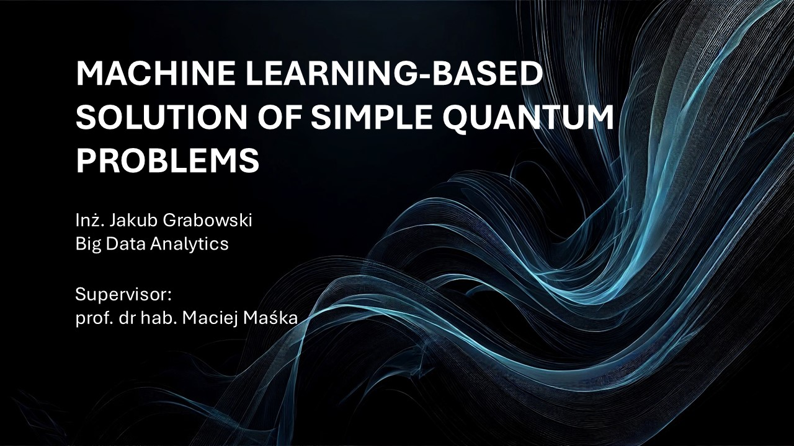
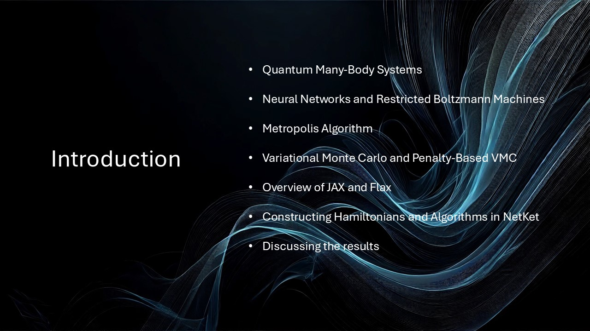
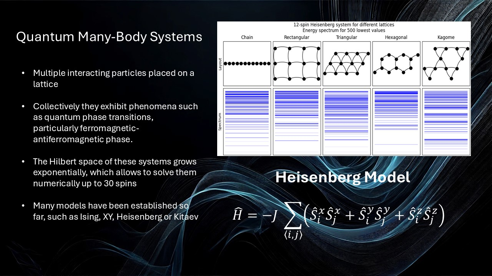
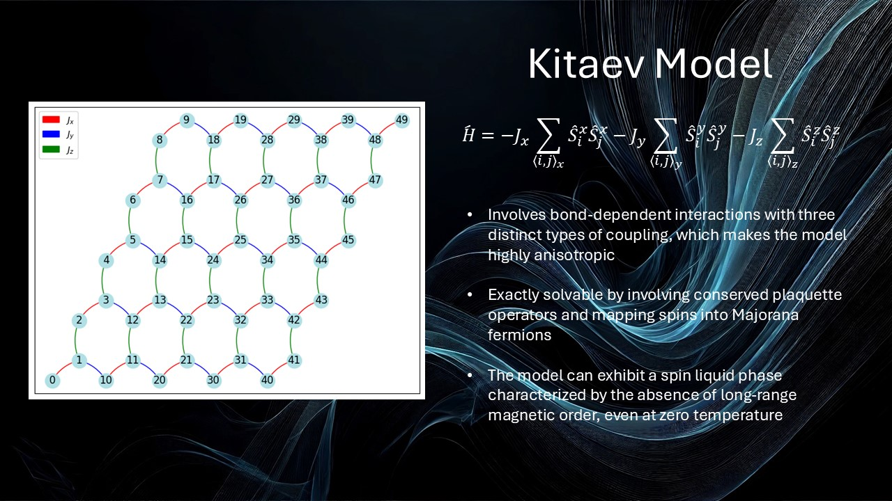
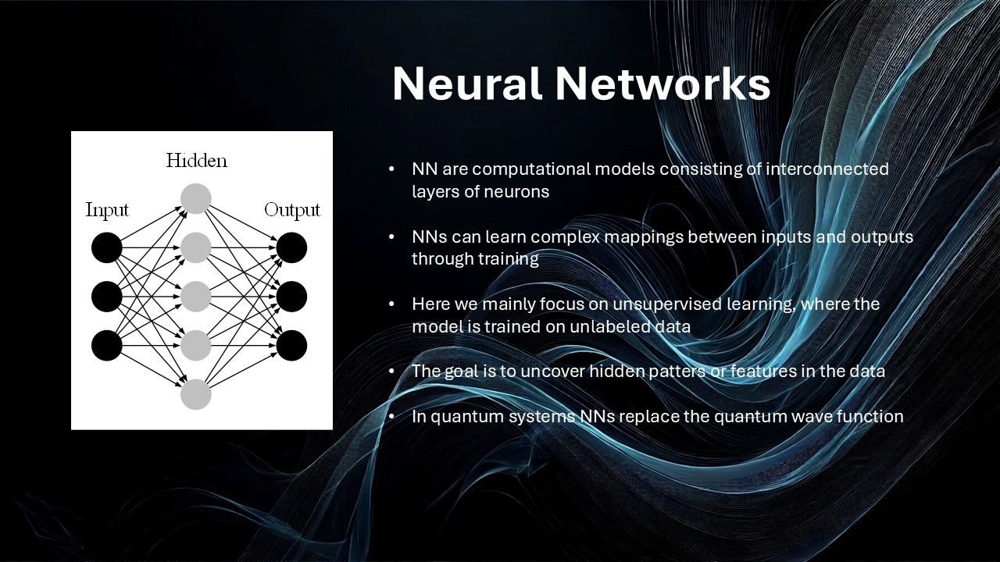
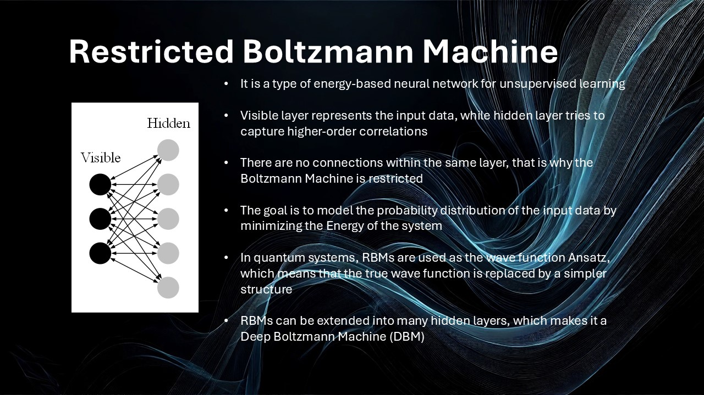
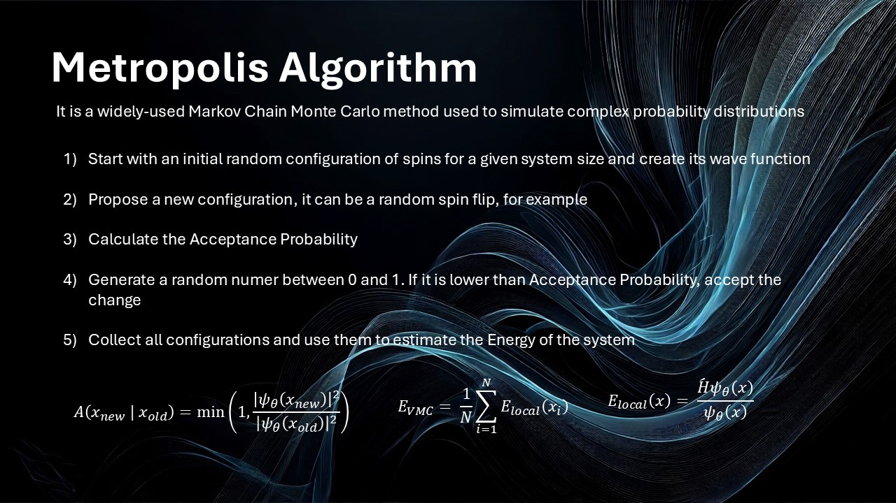
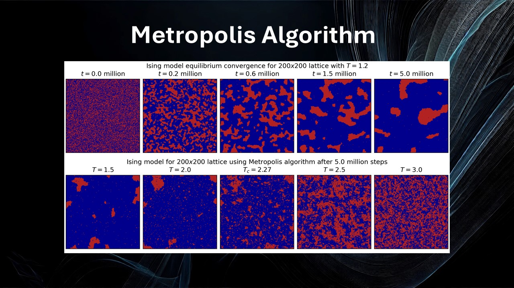
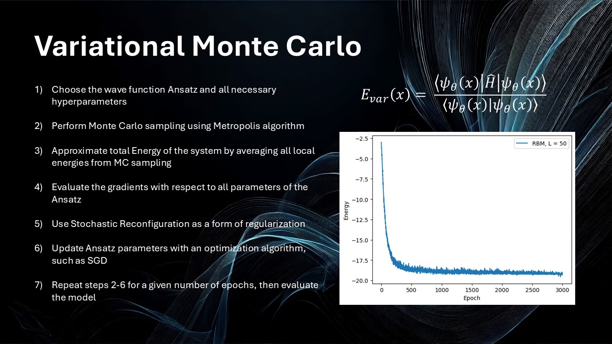
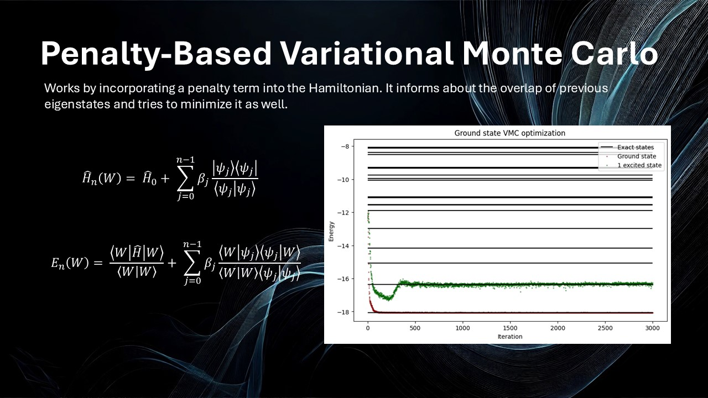
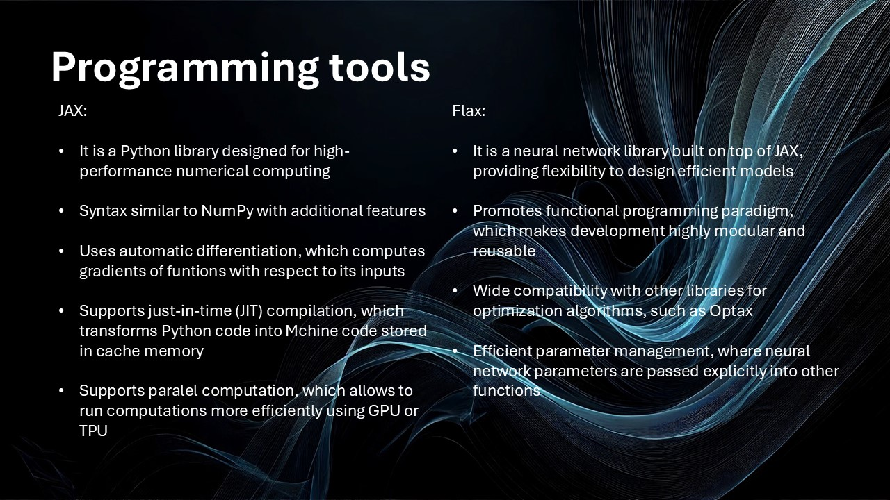
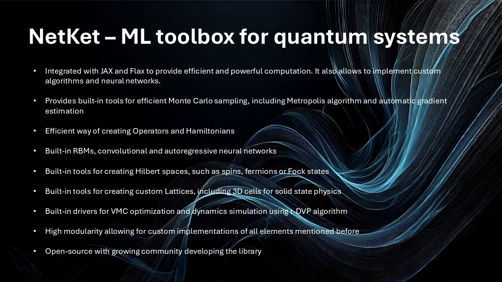
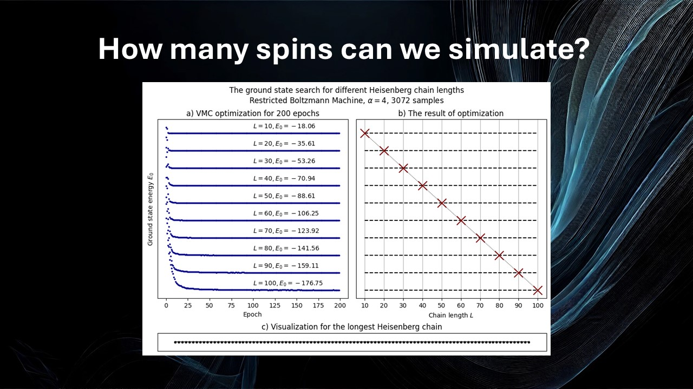
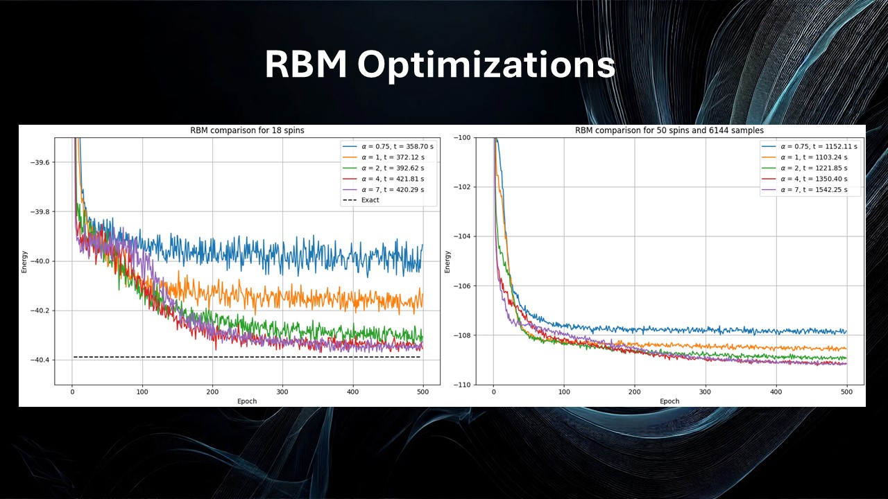
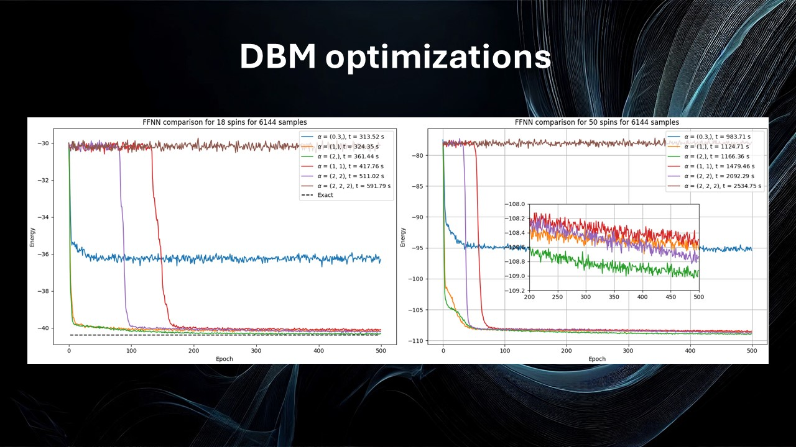
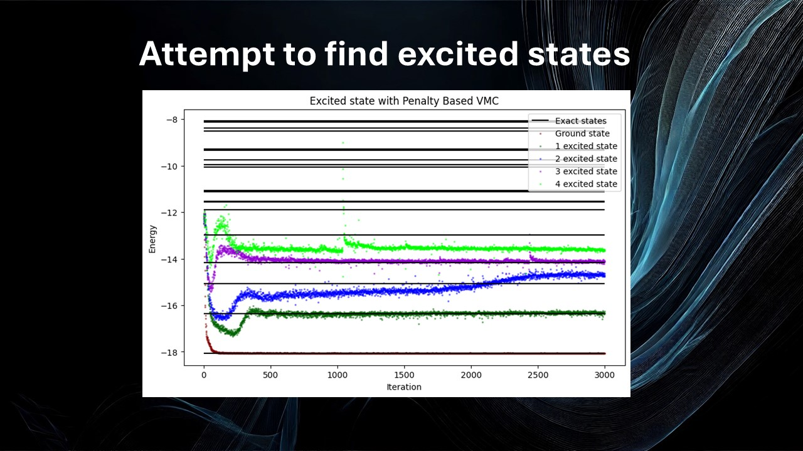
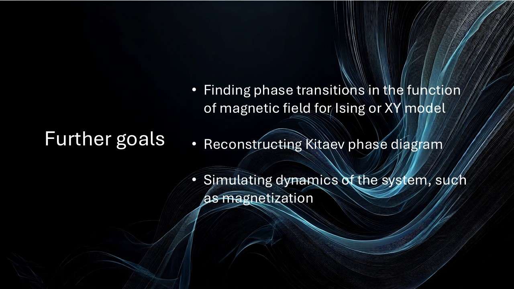
