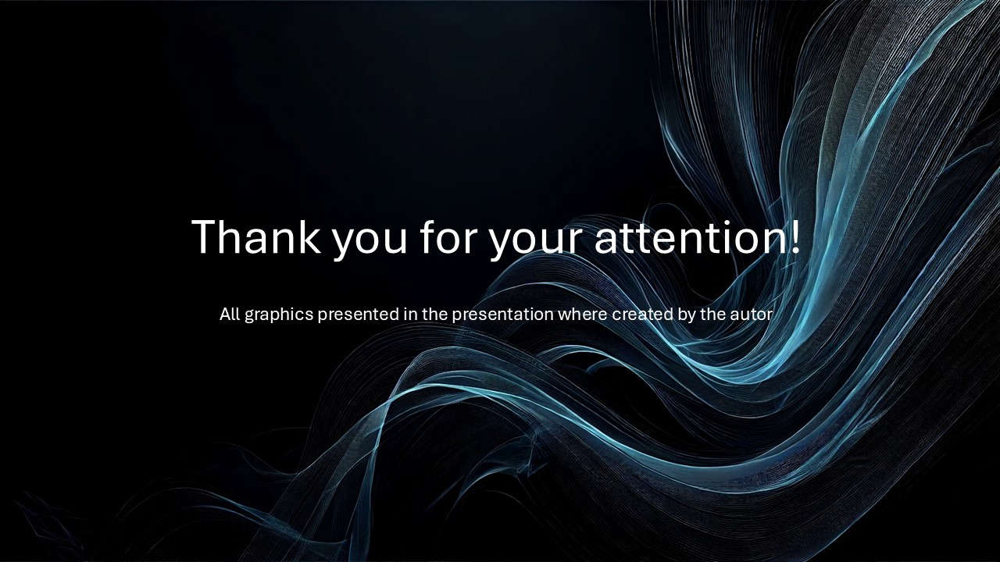

# Machine learning-based solution of simple quantum problems

This project contains the source code for Master's thesis at my university. 
It provides all necessary classes and functions used for finding the eigenvalues of quantum many-body systems. 
It utilises the package called `NetKet` which uses `JAX` and `Flax` to run Variational Monte Carlo algorithm 
with Restricted Boltzmann Machines as the wave function Ansatz.

The whole content of the thesis is attached in the file `thesis.pdf`.

# Presentation Slides

